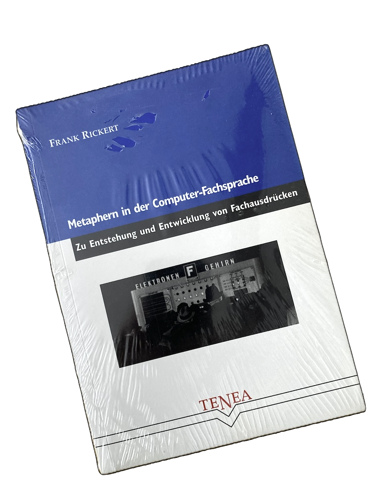

# Metaphern, Sprache, Computer
**A Publishing Project**

### DE
Diese Website ist ein Test, um Text zu bearbeiten und zu veröffentlichen. Ich bearbeite den Text bis ich glaube, dass die Textqualität und das Format ausreichend sind.

### EN
This website is a test for editing and publishing text. I edit the text until I believe the text quality and format are sufficient.

### License
Metaphern, Sprache, Computer © 2023 by Frank Rickert is licensed under CC BY-NC-SA 4.0 

# Vorwort zur Neuauflage

Seit der ersten Version dieser Arbeit 2002 sind über zwanzig Jahre vergangen.
Damals habe ich meine Magister-Arbeit mit dem Titel "Metaphern in der Computer-Fachsprache" als Buch verlegt, da ich die Möglichkeit dazu hatte.

Außerdem war das Vergütungsmodell der VG Wort so, dass ich die Druckkosten gegenfinanzieren konnte. Über zehn Jahre und durch eine günstiges Gerichtsurteil habe ich sogar etwas Plus gemacht. 

Wenn man eine Arbeit fertig gestellt hat, dann schaut man nicht mehr rein, dann gibt man nur noch ab. Warum? Weil man garantiert einen Fehler findet, abgesehen von Typos (Vertippern) auch fachliche Fehler. Um dies zu korrigieren, habe ich mich jetzt zu einer Überarbeitung des Buches entschlossen. Neben dem eigentlichen Thema, den *Metaphern in der Computerfachsprache*, ist es mir inzwischen auch wichtig einen gut lesbaren und typografisch ansprechenden Text zu produzieren. Ich nutze daher nun Latex bzw. Markdown, was durch die Software *R-Studio* in HTML und PDF-Ausgabe gebracht wird. Darüber hinaus verwende ich als Style-Vorlage [Tufte Handout](https://rstudio.github.io/tufte/).

Insgesamt versuche ich weniger akademisch, sondern einfach und verständlich zu schreiben.

**Und Achtung: Dieser Text ist Work in progress. Ich ändere da immer mal was.**

Juni 2023
